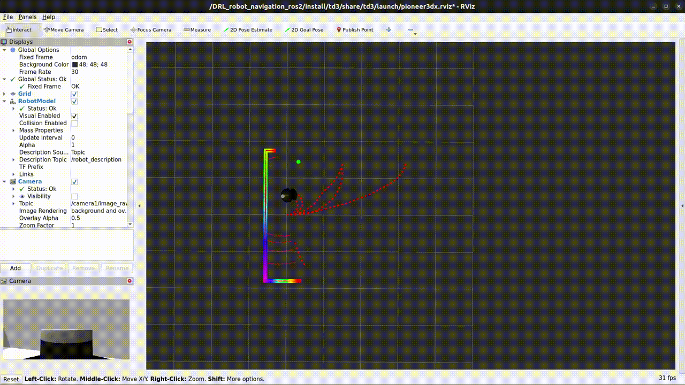
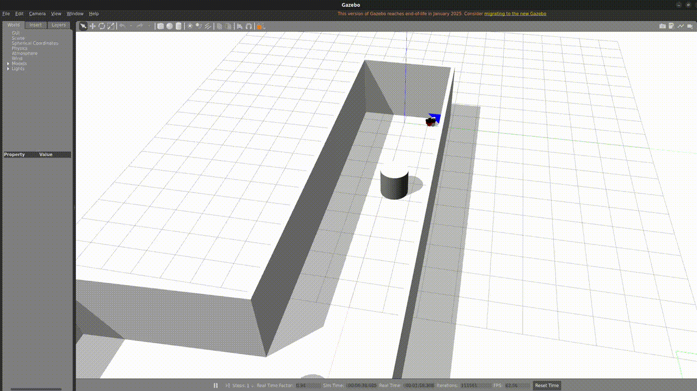

**Курсовая работа на тему: Обучение с подкреплением в мобильной робототехнике**

*Группа: АДМ-24-05*
*Выполнил: Мажуга Н.А*

---

# Введение
Данный отчет представляет анализ научной статьи «Goal-Driven Autonomous Exploration Through Deep Reinforcement Learning» (Cimurs et al., 2021, arXiv:2103.07119). Статья посвящена разработке системы автономной навигации для исследования неизвестных сред с использованием глубокого обучения с подкреплением (Deep Reinforcement Learning, DRL). В отчете рассмотрены цель исследования, политика обучения с подкреплением, результаты обучения агента и ключевые выводы.

# Цель исследования
Цель исследования заключается в создании системы автономной навигации, названной Goal-Driven Autonomous Exploration (GDAE), которая позволяет роботу достигать заданной глобальной цели в неизвестной среде без предварительных знаний или карты. Система решает две задачи:
- Глобальная навигация: выбор оптимальных промежуточных точек (waypoints) на основе точек интереса (POI) для достижения цели.
Локальная навигация: обучение политики движения с использованием DRL для перемещения между промежуточными точками с избеганием препятствий.
- GDAE направлена на минимизацию зависимости от предварительной информации, решение проблемы локальных оптимумов и обеспечение надежной работы в сложных статических и динамических средах.

# Политика обучения с подкреплением
## Общая характеристика
Для локальной навигации используется алгоритм Twin Delayed Deep Deterministic Policy Gradient (TD3), работающий в непрерывном пространстве действий. Политика заменяет традиционный локальный планировщик, обеспечивая реактивное движение на основе сенсорных данных.
## Цель и направление политики
**Цель:** Обучить робота перемещаться к локальной цели (waypoint), избегая препятствий.
**Входные данные:**
- Лазерные измерения (21 значение, агрегированные из 180° перед роботом).
- Полярные координаты промежуточной точки относительно положения и ориентации робота.

**Выходные данные:**
- Действия $a=[v,\omega]$, где $v$ — линейная скорость (только вперед), $\omega$ — угловая скорость. Максимальные значения: $v_{\max}=0.5$ м/с, $\omega_{\max}=1$ рад/с.

## Архитектура сети
**Актор** (actor): Два полносвязных слоя с активацией ReLU, выходной слой с активацией tanh для ограничения действий в $[-1,1]$.
**Критик** (critic): Две сети для оценки $Q$ - значений пар состояние-действие. Входы обрабатываются через полносвязные и трансформационные слои, затем объединяются. Минимальное $Q$ - значение выбирается для предотвращения переоценки.

## Функция вознаграждения
Вознаграждение $r(s_t, a_t)$ определяется следующим образом:

- $r_g$ (положительное) — если расстояние до цели $D_t < \eta_D$.
- $r_c$ (отрицательное) — при столкновении.
- $v - |\omega|$ — для поощрения движения вперед с минимальными поворотами.
- Отложенное вознаграждение: При достижении цели $r_g$ распределяется по $n=10$ предыдущим шагам по формуле $r_{t-i}=r(s_{t-i},a_{t-i})+\frac{r_g}{t}$.

## Процесс обучения
**Среда:** Симуляция Gazebo, 10×10 м, с четырьмя случайными препятствиями.
**Параметры:** 800 эпизодов, около 8 часов, NVIDIA GTX 1080.
**Особенности:** Добавлен гауссов шум для обобщения; эпизод завершался при достижении цели, столкновении или после 500 шагов.

# Результаты обучения агента
Результаты проверялись в количественных и качественных экспериментах в реальных условиях.
## Количественные эксперименты
**Эксперимент** (офисное помещение с перегородками):
- **GDAE:** Среднее расстояние 41.42 м, время 88.03 с, покрытая площадь 492.01 м², все 5 целей достигнуты.

**Сравнение:**
- **GD-RL** (DRL без глобальной стратегии): 77.02 м, 171.82 с, 580.63 м², 5/5 целей.
- **NF** (Nearest Frontier): 40.74 м, 109.11 с, 475.75 м², 5/5 целей.
- **LP-AE** (планирование): 40.03 м, 123.56 с, 491.57 м², 5/5 целей.
- **PP** (идеальный планировщик): 32.26 м, 61.53 с, без карты, 5/5 целей.

**GDAE** показала сбалансированные результаты по времени и покрытой площади.

**Начало обучения агента. Визуализатор Rviz**

**Начало обучения агента. Симулятор Gazebo**

**Конец обучения агента. Визуализатор Rviz**

## Качественные эксперименты
**Сценарии:**
- Навигация в коридоре с локальным оптимумом (угол комнаты): успешный обход.
- Старт в локальном оптимуме (узкий коридор): исследование и достижение цели.
- Среда с препятствиями (стулья, растения): успешная навигация.
- Большие пространства (коридоры, парковка): робот справился с навигацией на большие расстояния, избегая локальных оптимумов и составляя карту.

# Выводы
**Эффективность GDAE:** Система успешно объединяет глобальную стратегию (IDLE для выбора POI) и локальную политику DRL (TD3), обеспечивая надежное достижение цели в неизвестных средах.
**Преимущества:**
- Избежание локальных оптимумов.
- Надежность в сложных средах (прозрачные стены, мелкие препятствия).
- Сбалансированные показатели по времени, расстоянию и покрытой площади.

**Ограничения:**
- Ограничение на движение только вперед из-за лазерных данных.
- Необходимость улучшения для динамических сред.

**Будущие направления:**
- Учет движения назад и расширение сенсорного диапазона.
- Улучшение обобщения для динамических сред.
- Интеграция дополнительных сенсоров (например, камер).

# Заключение
GDAE представляет значительный прогресс в автономной навигации, демонстрируя потенциал для применения в реальных сценариях, таких как поисково-спасательные операции или исследование опасных сред. Сочетание DRL и глобальной стратегии делает систему гибкой и надежной.
